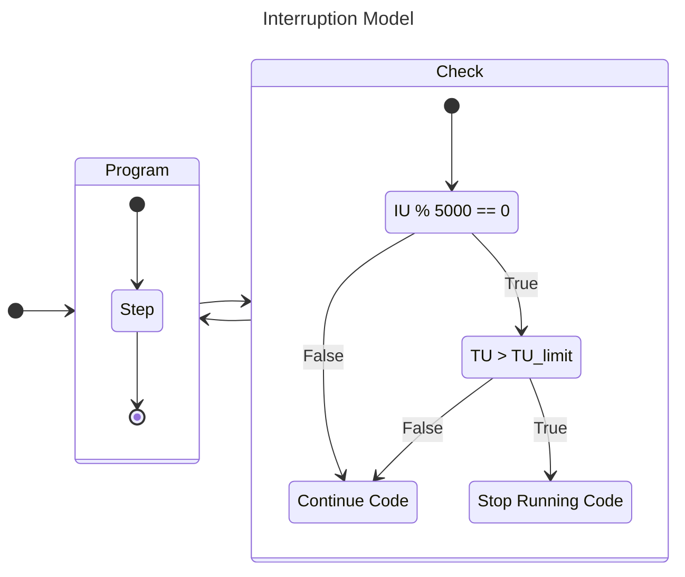

# GlitchHunterCoder

<div align="center">
<!--
[](https://github.com/fastify/fastify/actions/workflows/ci.yml)
[](https://github.com/fastify/fastify/actions/workflows/package-manager-ci.yml)
[](https://github.com/fastify/fastify/actions/workflows/website.yml)
[](https://snyk.io/test/github/fastify/fastify)
[](https://coveralls.io/github/fastify/fastify?branch=main)
[](https://standardjs.com/)
-->
</div>

## Socials
- [Discord Profile](https://discord.com/users/1054017238606286928)
- [Discord Server for Advanced Coders](https://discord.gg/nTTktDKVZx)
- [Fandom Profile](https://bloxd-io.fandom.com/wiki/User:GlitchHunterCode)
## Skills

<p align="center"><a href="https://git.io/typing-svg"></a></p>

<p align="center">
  
  <a href="https://skillicons.dev">
    
  </a> 
</p>

<details>
  <summary>Bloxd Runtime Graph</summary>



</details>

<details>
  <summary>Voxel Simulator</summary>

```stl
solid merged
facet
outer loop
vertex 0 0 0
vertex 50 0 0
vertex 0 50 0
endloop
endfacet
facet
outer loop
vertex 50 0 0
vertex 50 50 0
vertex 0 50 0
endloop
endfacet
facet
outer loop
vertex 0 0 10
vertex 0 50 10
vertex 50 0 10
endloop
endfacet
facet
outer loop
vertex 50 0 10
vertex 0 50 10
vertex 50 50 10
endloop
endfacet
facet
outer loop
vertex 0 0 0
vertex 0 0 10
vertex 50 0 0
endloop
endfacet
facet
outer loop
vertex 50 0 0
vertex 0 0 10
vertex 50 0 10
endloop
endfacet
facet
outer loop
vertex 0 50 0
vertex 50 50 0
vertex 0 50 10
endloop
endfacet
facet
outer loop
vertex 50 50 0
vertex 50 50 10
vertex 0 50 10
endloop
endfacet
facet
outer loop
vertex 0 0 0
vertex 0 50 0
vertex 0 0 10
endloop
endfacet
facet
outer loop
vertex 0 50 0
vertex 0 50 10
vertex 0 0 10
endloop
endfacet
facet
outer loop
vertex 50 0 0
vertex 50 0 10
vertex 50 50 0
endloop
endfacet
facet
outer loop
vertex 50 50 0
vertex 50 0 10
vertex 50 50 10
endloop
endfacet
facet
outer loop
vertex 20 20 10
vertex 30 20 10
vertex 20 30 10
endloop
endfacet
facet
outer loop
vertex 30 20 10
vertex 30 30 10
vertex 20 30 10
endloop
endfacet
facet
outer loop
vertex 20 20 30
vertex 20 30 30
vertex 30 20 30
endloop
endfacet
facet
outer loop
vertex 30 20 30
vertex 20 30 30
vertex 30 30 30
endloop
endfacet
facet
outer loop
vertex 20 20 10
vertex 20 20 30
vertex 30 20 10
endloop
endfacet
facet
outer loop
vertex 30 20 10
vertex 20 20 30
vertex 30 20 30
endloop
endfacet
facet
outer loop
vertex 20 30 10
vertex 30 30 10
vertex 20 30 30
endloop
endfacet
facet
outer loop
vertex 30 30 10
vertex 30 30 30
vertex 20 30 30
endloop
endfacet
facet
outer loop
vertex 20 20 10
vertex 20 30 10
vertex 20 20 30
endloop
endfacet
facet
outer loop
vertex 20 30 10
vertex 20 30 30
vertex 20 20 30
endloop
endfacet
facet
outer loop
vertex 30 20 10
vertex 30 20 30
vertex 30 30 10
endloop
endfacet
facet
outer loop
vertex 30 30 10
vertex 30 20 30
vertex 30 30 30
endloop
endfacet
facet
outer loop
vertex 0 0 30
vertex 50 0 30
vertex 0 50 30
endloop
endfacet
facet
outer loop
vertex 50 0 30
vertex 50 50 30
vertex 0 50 30
endloop
endfacet
facet
outer loop
vertex 0 0 40
vertex 0 50 40
vertex 50 0 40
endloop
endfacet
facet
outer loop
vertex 50 0 40
vertex 0 50 40
vertex 50 50 40
endloop
endfacet
facet
outer loop
vertex 0 0 30
vertex 0 0 40
vertex 50 0 30
endloop
endfacet
facet
outer loop
vertex 50 0 30
vertex 0 0 40
vertex 50 0 40
endloop
endfacet
facet
outer loop
vertex 0 50 30
vertex 50 50 30
vertex 0 50 40
endloop
endfacet
facet
outer loop
vertex 50 50 30
vertex 50 50 40
vertex 0 50 40
endloop
endfacet
facet
outer loop
vertex 0 0 30
vertex 0 50 30
vertex 0 0 40
endloop
endfacet
facet
outer loop
vertex 0 50 30
vertex 0 50 40
vertex 0 0 40
endloop
endfacet
facet
outer loop
vertex 50 0 30
vertex 50 0 40
vertex 50 50 30
endloop
endfacet
facet
outer loop
vertex 50 50 30
vertex 50 0 40
vertex 50 50 40
endloop
endfacet
facet
outer loop
vertex 10 10 40
vertex 40 10 40
vertex 10 40 40
endloop
endfacet
facet
outer loop
vertex 40 10 40
vertex 40 40 40
vertex 10 40 40
endloop
endfacet
facet
outer loop
vertex 10 10 50
vertex 10 40 50
vertex 40 10 50
endloop
endfacet
facet
outer loop
vertex 40 10 50
vertex 10 40 50
vertex 40 40 50
endloop
endfacet
facet
outer loop
vertex 10 10 40
vertex 10 10 50
vertex 40 10 40
endloop
endfacet
facet
outer loop
vertex 40 10 40
vertex 10 10 50
vertex 40 10 50
endloop
endfacet
facet
outer loop
vertex 10 40 40
vertex 40 40 40
vertex 10 40 50
endloop
endfacet
facet
outer loop
vertex 40 40 40
vertex 40 40 50
vertex 10 40 50
endloop
endfacet
facet
outer loop
vertex 10 10 40
vertex 10 40 40
vertex 10 10 50
endloop
endfacet
facet
outer loop
vertex 10 40 40
vertex 10 40 50
vertex 10 10 50
endloop
endfacet
facet
outer loop
vertex 40 10 40
vertex 40 10 50
vertex 40 40 40
endloop
endfacet
facet
outer loop
vertex 40 40 40
vertex 40 10 50
vertex 40 40 50
endloop
endfacet
endsolid
```

</details>

## Projects
### Short Project List
-  [x] Async Engine
-  [x] Perfect Interrupt Safety
-  [ ] Bloxd Game Engine
### Project Phases
- `Begin`: when a new rough idea is being made, BUT no progress is made on it
- `Discover`: when a new rough idea is being made, AND work has began on it
- `Pinpoint`: when the idea is being made alot clearer
- `Refine`: finding a method which enables the idea to come to reality
- `Utilise`: the code writing phase
- `Release`: when the code is done, and no more changes will need to be added to code, BUT changes to README still are occuring
- `End`: when the code is done AND no more changes will need to be added to ANY part of repo (INCLUDING README)
### Project List
<details>
  <summary>Open File</summary>

#### Working
> **Idea is Running smoothly without issues**
- Began: Projects which are in `Begin` phase
- Discovered: Projects which are in `Discover` phase
- Pinpointed: Projects which are in `Pinpoint` phase
- Refined: Projects which are in `Refine` phase
- Utilised: Projects which are in `Utilise` phase
- Released: Projects which are in `Released` phase
- Ended: Projects which are in `End` phase
#### Halted
> **Has gotten stuck at some point, but still finding progress**
- Began: halted at beginning work on idea
- Discover: halted at pinpointing exact idea
- Pinpointed: halted at finding a method
- Refined: 
- Utilised: 
- Released: 
- Ended: 
#### Awaiting
> **Idea has stopped progress at a stage for a given reason**
- Paused: Projects which are in any phase but currently paused due to other projects
- Postpone: Projects which are in `Refine` phase, but needed method doesnt exist yet
#### Resolves
> **Problems which have been resolved and sorted**
<!--i totally didnt steal that name from ASYNC ... -->

#### Rejects
> **Problems which have not been resolved yet**
<!-- ... its coincidence i swear -->

#### Given
- **Idea has been given to someone else to work on due to some criteria**

</details>
<!--
**GlitchHunterCoder/GlitchHunterCoder** is a ✨ _special_ ✨ repository because its `README.md` (this file) appears on your GitHub profile.

Here are some ideas to get you started:

- 🔭 I’m currently working on ...
- 🌱 I’m currently learning ...
- 👯 I’m looking to collaborate on ...
- 🤔 I’m looking for help with ...
- 💬 Ask me about ...
- 📫 How to reach me: ...
- 😄 Pronouns: ...
- ⚡ Fun fact: ...
-->
