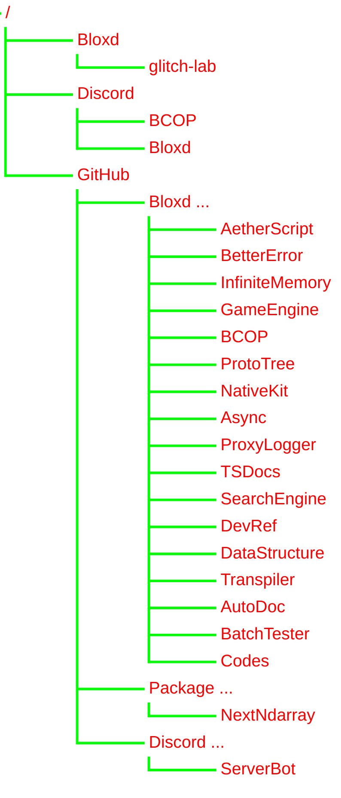

# GlitchHunterCoder


<details>

<summary>Open『README』file</summary>


JavaScript runtime experimenter and systems developer focused on advanced execution behaviour, async control systems, and sandbox-safe runtime environments.

Most of my work explores how far the JavaScript runtime can be pushed beyond normal application code.

Primary focus areas:

* JS introspection
* runtime architecture
* limit breaking
* glitch hunting (of course)
* systems improvement

---

# Core Skills

<p align="center">
  
</p>

<p align="center">
  
</p>

### Languages

* JavaScript

### Specialisations

* reverse engineering
* logic experimentation
* analysis of conditions
* interruption-safe runtime systems
* Execution graph modelling

### Research Areas

* JavaScript compiling/execution semantics
* environment inspection
* runtime introspection
* memory behaviour experimentation
* code optimisations via tests

---

# Major Projects

### Async Engine

Custom asynchronous execution system designed to run tasks deterministically.

Features:

* generator task support
* queue based scheduling
* safe execution ordering
* lightweight runtime

Status: Release

---

### Perfect Interrupt Safety

Research project investigating how runtime execution can be safely interrupted and resumed.

Concepts explored:

* deterministic execution checkpoints
* execution state preservation
* safe interruption boundaries

Status: Release

---

### Bloxd Game Engine

Experimental scripting engine designed for Bloxd environments.

Goals:

* sandbox safe execution
* high performance runtime
* modding support

Status: Discover

---

# Runtime Experiments

### Proxy Logging Framework

Deep object graph inspection using layered proxy systems.

Capabilities:

* nested object tracking
* mutation logging
* runtime behaviour tracing
* cyclic graph handling

---

### JavaScript Memory Experiments

Testing how different structures affect observable runtime memory behaviour.

Structures tested:

* primitives
* arrays
* nested objects
* mixed structures

Findings suggest results are heavily influenced by pointer references rather than raw allocation.

---

## Runtime Architecture

Bloxd runtime execution model visualisation.

<details>
<summary>Open Runtime Graph</summary>

[![](https://mermaid.ink/img/pako:eNqdWI1P2zgU_1esoIndXYsKK1UbaZPWQG-VYHdqy7i7gaq0cVuLJI4cF-hQ__d7z44TO4SNDW114vfp3_uwnSdvySPq-V673b5JlzxdsbV_kxIShzu-lT6h8R2-yg1NqE9SyttRKNRUzPmdmlF0JmOgj1NJhdhmkvGUXILmuBT-EgoWLmKaK_WErHgqR2HC4p1PEp7yPAuXFAkHIGheR8Ck2V_8OyBndBVuY0mOjo40byZYEordjD7KgMdc-OTwYDQaHQLvZ_CJIIEoiuaPWUpdxlL3ebSmNqt8ptNlravOKWAKiO1KoQ78HZb8ZzRfCqbxcswIyWypkRJCsYAnGc-ZdNxKQpYO79aF_kMbnYr_Ew0jW2gRLu_Wgm_TyLZQExryaGcLfScOGNEp-wZpcNjtZI-HN6lKqlyGkp6xcC3CpH1_gmrevCEjAdzkPI3IF0YfCF-RYcwfI6Qu4zDPIajkmos4CiBiU7mLKVmxOPZxfa2lgiXbiiymLTTbfqBsvZH-gsdRK5eC39H2A4vkxu9lj8VEwe9YQOVgd3nXbOFhAxC83gCscIfqiyVOacKqdbYIy8k9yxnUQIssthLKAmbg34KLiAqyoPKB0pSslEQIyGCAaOpiolC64GHketz_NY9BsttSSd3ON2HEH3xykj2q_4t462J1nt5bNhcxOFcYXaOJ16OExJdsglILwXMhuCCzXUZzgIyydE1W23SJ1ZJjylCkAwnBWoUyjAumLBSSABTLDcklz3KCTY7QVDJB4527KlRhY9n_1egfdEGyeV2CukEcoa_PLK9Kyxrcn4niDywXeA51QiF0i2fVBg36hfjGLPkJHBT36-K74iIJZU5qLQJLATqg49149YJzPxklzf4D96pqC_OmfIc6d2u-FKp6VotcB7UOVnGVfadFgmGtC1VcHyHT70N09yqL1DiVkNkt1TbdRlAJQZmWpVrNTkD8giUMhO09Wr3Npy1Fn0-taqhEzwDayTZF4zzTK_vMgzCO62lciYyv5lcp2pqZh8mseBhfdeZjHNAqvkwV11SxwO8wwN-ppJn-RWY1BmYclplqGVzNx1ctHGZ6mMzUcB3MP6qHYGgewHHsqzjmamZqcqtSp-E-g-UhQOi2EaueLlguVX7o6H_9_Za02x8Qep_w9IIvFjsVLSRqfYoOfCX9PC2LE6OGZM1ZkwGixefjD4NNIqH6cKSqR2l40nu0yRufXMK5oDiIKCZDMZzEgARHN2u_JcEmTNe6dRRMCKBiKpOV_C1onldMBoFCY82AIl0HPpkJva_UaaWNURjntGZZcQRDVxrflbfKnSYJnac1leiEWqkSrpSZ8FR87sxeD2aZBkoXcldE_2La-kXygsW3vz3hUdXo04FBahWUCPYptcuRi4mZw8LwyXAnqe22Kl_33D0PNnR59_Y3w6JL269aQJ1BVaFPjuCBvCcdC8hpGXHsAqXResS1BdeejilqdsyoaVyKvSwT_6ltWk_q5bkpgXPP9JQiqsDsNDGjBlrZe6rOsiosxz75-pUcl-iCDWjv5Pa24sOGpTH6o5rEloWTk5k1aVDRmuuW6lnmzKORRgIaMoS9k452ElX1-91MqndBHeRiJnciXdY0NEEIAxPQ82AvwAPE0slCJnWJWs3RJ3-GcPMTZFQc2fCixoDTnN5Kk2UN2q3VVucro-aNXHCe1WXKHmKv7KUVN_iKGQNbdggLOe0ksDOoIlFMBDleparI1BbcYO8pkRxux3gdNC7iQ3NWKgCtrGwKW5EQY6eVvJB247pQPe32zX6Urr7Ol-A1vgR1oRd82d84W1W1z5S-FPt_o1HX5LAm8qyT6we7bTY30YZW7XzjeLK727ihieoDkCaYyVk1OZnVOE0eP-M2hNkVNCuxhbtMQsns03hK6CNd3jbswpUK9eKjax_eQ3p3Og6haptun8UV1WNVCRSu1LZznJoUzn0wT3O17ThcRaz0gdLVUs2WSDsnkUK4ANxxub5X22Ert78qZsWh1I1DMWnWOJlZcP_15XxCLj9-_tfFvDgh--TGUw3kH7j642efnAwpXHEo4pDivVTt3F5DqKw00CZ_jOFkpoRL27VAFOR6WAtgSjAajgVWyu_NsVNDWBxJn9yDUHVY1vPVu508e6_lrQWLPF9ip_USClc_fPWUuhtPfSS88RBE9YURYEKZLEz_4zwxYoJv1xvPX6k26221KX1xLFnghktFwAE3z-_2ekqH5z95j55_fHpydNoZDE56_eOTfrc3aHk7z2_3jo8G3W6_Mzgd9E77vcHxvuV9U1aPjzqn_Xcng_5JpwfDuy6ooxGTXFzq76bq8-n-f1zNiRk?type=png)](https://mermaid.live/edit#pako:eNqdWI1P2zgU_1esoIndXYsKK1UbaZPWQG-VYHdqy7i7gaq0cVuLJI4cF-hQ__d7z44TO4SNDW114vfp3_uwnSdvySPq-V673b5JlzxdsbV_kxIShzu-lT6h8R2-yg1NqE9SyttRKNRUzPmdmlF0JmOgj1NJhdhmkvGUXILmuBT-EgoWLmKaK_WErHgqR2HC4p1PEp7yPAuXFAkHIGheR8Ck2V_8OyBndBVuY0mOjo40byZYEordjD7KgMdc-OTwYDQaHQLvZ_CJIIEoiuaPWUpdxlL3ebSmNqt8ptNlravOKWAKiO1KoQ78HZb8ZzRfCqbxcswIyWypkRJCsYAnGc-ZdNxKQpYO79aF_kMbnYr_Ew0jW2gRLu_Wgm_TyLZQExryaGcLfScOGNEp-wZpcNjtZI-HN6lKqlyGkp6xcC3CpH1_gmrevCEjAdzkPI3IF0YfCF-RYcwfI6Qu4zDPIajkmos4CiBiU7mLKVmxOPZxfa2lgiXbiiymLTTbfqBsvZH-gsdRK5eC39H2A4vkxu9lj8VEwe9YQOVgd3nXbOFhAxC83gCscIfqiyVOacKqdbYIy8k9yxnUQIssthLKAmbg34KLiAqyoPKB0pSslEQIyGCAaOpiolC64GHketz_NY9BsttSSd3ON2HEH3xykj2q_4t462J1nt5bNhcxOFcYXaOJ16OExJdsglILwXMhuCCzXUZzgIyydE1W23SJ1ZJjylCkAwnBWoUyjAumLBSSABTLDcklz3KCTY7QVDJB4527KlRhY9n_1egfdEGyeV2CukEcoa_PLK9Kyxrcn4niDywXeA51QiF0i2fVBg36hfjGLPkJHBT36-K74iIJZU5qLQJLATqg49149YJzPxklzf4D96pqC_OmfIc6d2u-FKp6VotcB7UOVnGVfadFgmGtC1VcHyHT70N09yqL1DiVkNkt1TbdRlAJQZmWpVrNTkD8giUMhO09Wr3Npy1Fn0-taqhEzwDayTZF4zzTK_vMgzCO62lciYyv5lcp2pqZh8mseBhfdeZjHNAqvkwV11SxwO8wwN-ppJn-RWY1BmYclplqGVzNx1ctHGZ6mMzUcB3MP6qHYGgewHHsqzjmamZqcqtSp-E-g-UhQOi2EaueLlguVX7o6H_9_Za02x8Qep_w9IIvFjsVLSRqfYoOfCX9PC2LE6OGZM1ZkwGixefjD4NNIqH6cKSqR2l40nu0yRufXMK5oDiIKCZDMZzEgARHN2u_JcEmTNe6dRRMCKBiKpOV_C1onldMBoFCY82AIl0HPpkJva_UaaWNURjntGZZcQRDVxrflbfKnSYJnac1leiEWqkSrpSZ8FR87sxeD2aZBkoXcldE_2La-kXygsW3vz3hUdXo04FBahWUCPYptcuRi4mZw8LwyXAnqe22Kl_33D0PNnR59_Y3w6JL269aQJ1BVaFPjuCBvCcdC8hpGXHsAqXResS1BdeejilqdsyoaVyKvSwT_6ltWk_q5bkpgXPP9JQiqsDsNDGjBlrZe6rOsiosxz75-pUcl-iCDWjv5Pa24sOGpTH6o5rEloWTk5k1aVDRmuuW6lnmzKORRgIaMoS9k452ElX1-91MqndBHeRiJnciXdY0NEEIAxPQ82AvwAPE0slCJnWJWs3RJ3-GcPMTZFQc2fCixoDTnN5Kk2UN2q3VVucro-aNXHCe1WXKHmKv7KUVN_iKGQNbdggLOe0ksDOoIlFMBDleparI1BbcYO8pkRxux3gdNC7iQ3NWKgCtrGwKW5EQY6eVvJB247pQPe32zX6Urr7Ol-A1vgR1oRd82d84W1W1z5S-FPt_o1HX5LAm8qyT6we7bTY30YZW7XzjeLK727ihieoDkCaYyVk1OZnVOE0eP-M2hNkVNCuxhbtMQsns03hK6CNd3jbswpUK9eKjax_eQ3p3Og6haptun8UV1WNVCRSu1LZznJoUzn0wT3O17ThcRaz0gdLVUs2WSDsnkUK4ANxxub5X22Ert78qZsWh1I1DMWnWOJlZcP_15XxCLj9-_tfFvDgh--TGUw3kH7j642efnAwpXHEo4pDivVTt3F5DqKw00CZ_jOFkpoRL27VAFOR6WAtgSjAajgVWyu_NsVNDWBxJn9yDUHVY1vPVu508e6_lrQWLPF9ip_USClc_fPWUuhtPfSS88RBE9YURYEKZLEz_4zwxYoJv1xvPX6k26221KX1xLFnghktFwAE3z-_2ekqH5z95j55_fHpydNoZDE56_eOTfrc3aHk7z2_3jo8G3W6_Mzgd9E77vcHxvuV9U1aPjzqn_Xcng_5JpwfDuy6ooxGTXFzq76bq8-n-f1zNiRk)

</details>

---

# Project Lifecycle

Projects move through the following phases:

Begin → Discover → Pinpoint → Refine → Utilise → Release → End

| Project                  | Phase    |
| ------------------------ | -------- |
| Async Engine             | Utilise  |
| Perfect Interrupt Safety | Refine   |
| Bloxd Game Engine        | Discover |

---

## Idea Vault

<details>

<summary>Open Idea Vault</summary>

| Idea | Concept |
|-----|-----|
| Deterministic Async Runtime | fully predictable event loop |
| Interrupt Safe Execution | pause + resume execution safely |
| Proxy Runtime Tracing | complete object mutation history |
| JS Memory Mapping | understand allocation behaviour |

</details>

---

## Experimental Model

I dont just experiment with bloxd-io, anything i can get my hands on, i will experiment with, proof is below

<details>
<summary>Voxel Simulator Model</summary>

```stl
solid merged
facet
outer loop
vertex 0 0 0
vertex 50 0 0
vertex 0 50 0
endloop
endfacet
facet
outer loop
vertex 50 0 0
vertex 50 50 0
vertex 0 50 0
endloop
endfacet
facet
outer loop
vertex 0 0 10
vertex 0 50 10
vertex 50 0 10
endloop
endfacet
facet
outer loop
vertex 50 0 10
vertex 0 50 10
vertex 50 50 10
endloop
endfacet
facet
outer loop
vertex 0 0 0
vertex 0 0 10
vertex 50 0 0
endloop
endfacet
facet
outer loop
vertex 50 0 0
vertex 0 0 10
vertex 50 0 10
endloop
endfacet
facet
outer loop
vertex 0 50 0
vertex 50 50 0
vertex 0 50 10
endloop
endfacet
facet
outer loop
vertex 50 50 0
vertex 50 50 10
vertex 0 50 10
endloop
endfacet
facet
outer loop
vertex 0 0 0
vertex 0 50 0
vertex 0 0 10
endloop
endfacet
facet
outer loop
vertex 0 50 0
vertex 0 50 10
vertex 0 0 10
endloop
endfacet
facet
outer loop
vertex 50 0 0
vertex 50 0 10
vertex 50 50 0
endloop
endfacet
facet
outer loop
vertex 50 50 0
vertex 50 0 10
vertex 50 50 10
endloop
endfacet
facet
outer loop
vertex 20 20 10
vertex 30 20 10
vertex 20 30 10
endloop
endfacet
facet
outer loop
vertex 30 20 10
vertex 30 30 10
vertex 20 30 10
endloop
endfacet
facet
outer loop
vertex 20 20 30
vertex 20 30 30
vertex 30 20 30
endloop
endfacet
facet
outer loop
vertex 30 20 30
vertex 20 30 30
vertex 30 30 30
endloop
endfacet
facet
outer loop
vertex 20 20 10
vertex 20 20 30
vertex 30 20 10
endloop
endfacet
facet
outer loop
vertex 30 20 10
vertex 20 20 30
vertex 30 20 30
endloop
endfacet
facet
outer loop
vertex 20 30 10
vertex 30 30 10
vertex 20 30 30
endloop
endfacet
facet
outer loop
vertex 30 30 10
vertex 30 30 30
vertex 20 30 30
endloop
endfacet
facet
outer loop
vertex 20 20 10
vertex 20 30 10
vertex 20 20 30
endloop
endfacet
facet
outer loop
vertex 20 30 10
vertex 20 30 30
vertex 20 20 30
endloop
endfacet
facet
outer loop
vertex 30 20 10
vertex 30 20 30
vertex 30 30 10
endloop
endfacet
facet
outer loop
vertex 30 30 10
vertex 30 20 30
vertex 30 30 30
endloop
endfacet
facet
outer loop
vertex 0 0 30
vertex 50 0 30
vertex 0 50 30
endloop
endfacet
facet
outer loop
vertex 50 0 30
vertex 50 50 30
vertex 0 50 30
endloop
endfacet
facet
outer loop
vertex 0 0 40
vertex 0 50 40
vertex 50 0 40
endloop
endfacet
facet
outer loop
vertex 50 0 40
vertex 0 50 40
vertex 50 50 40
endloop
endfacet
facet
outer loop
vertex 0 0 30
vertex 0 0 40
vertex 50 0 30
endloop
endfacet
facet
outer loop
vertex 50 0 30
vertex 0 0 40
vertex 50 0 40
endloop
endfacet
facet
outer loop
vertex 0 50 30
vertex 50 50 30
vertex 0 50 40
endloop
endfacet
facet
outer loop
vertex 50 50 30
vertex 50 50 40
vertex 0 50 40
endloop
endfacet
facet
outer loop
vertex 0 0 30
vertex 0 50 30
vertex 0 0 40
endloop
endfacet
facet
outer loop
vertex 0 50 30
vertex 0 50 40
vertex 0 0 40
endloop
endfacet
facet
outer loop
vertex 50 0 30
vertex 50 0 40
vertex 50 50 30
endloop
endfacet
facet
outer loop
vertex 50 50 30
vertex 50 0 40
vertex 50 50 40
endloop
endfacet
facet
outer loop
vertex 10 10 40
vertex 40 10 40
vertex 10 40 40
endloop
endfacet
facet
outer loop
vertex 40 10 40
vertex 40 40 40
vertex 10 40 40
endloop
endfacet
facet
outer loop
vertex 10 10 50
vertex 10 40 50
vertex 40 10 50
endloop
endfacet
facet
outer loop
vertex 40 10 50
vertex 10 40 50
vertex 40 40 50
endloop
endfacet
facet
outer loop
vertex 10 10 40
vertex 10 10 50
vertex 40 10 40
endloop
endfacet
facet
outer loop
vertex 40 10 40
vertex 10 10 50
vertex 40 10 50
endloop
endfacet
facet
outer loop
vertex 10 40 40
vertex 40 40 40
vertex 10 40 50
endloop
endfacet
facet
outer loop
vertex 40 40 40
vertex 40 40 50
vertex 10 40 50
endloop
endfacet
facet
outer loop
vertex 10 10 40
vertex 10 40 40
vertex 10 10 50
endloop
endfacet
facet
outer loop
vertex 10 40 40
vertex 10 40 50
vertex 10 10 50
endloop
endfacet
facet
outer loop
vertex 40 10 40
vertex 40 10 50
vertex 40 40 40
endloop
endfacet
facet
outer loop
vertex 40 40 40
vertex 40 10 50
vertex 40 40 50
endloop
endfacet
endsolid
```

</details>

---

# Community

Discord Profile
https://discord.com/users/1054017238606286928

Advanced Coders Discord
https://discord.gg/nTTktDKVZx

Bloxd Wiki
https://bloxd-io.fandom.com/wiki/User:GlitchHunterCode

---

# Development Philosophy

JavaScript is not just a language but a runtime laboratory.

Most of my projects explore:

* execution control
* runtime safety
* introspection
* unusual behaviour of the JavaScript engine

</details>

<details>

<summary>Open『PROJECT_DASHBOARD』file</summary>


```mermaid
---
config:
    treeView:
        rowIndent: 80
        lineThickness: 3
    themeVariables:
        treeView:
            labelFontSize: '20px'
            labelColor: '#FF0000'
            lineColor: '#00FF00'
---
treeView-beta
    "Bloxd"
        "glitch-lab"
    "Discord"
        "BCOP"
        "Bloxd"
    "GitHub"
        "Bloxd ..."
            "AetherScript"
            "BetterError"
            "InfiniteMemory"
            "GameEngine"
            "BCOP"
            "ProtoTree"
            "NativeKit"
            "Async"
            "ProxyLogger"
            "TSDocs"
            "SearchEngine"
            "DevRef"
            "DataStructure"
            "Transpiler"
            "AutoDoc"
            "BatchTester"
            "Codes"
        "Package ..."
            "NextNdarray"
        "Discord ..."
            "ServerBot"
```

</details>
